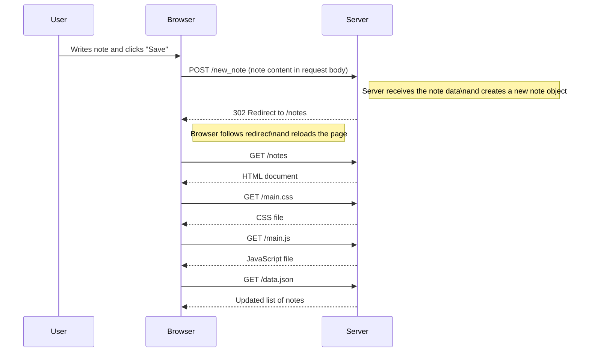

```mermaid
sequenceDiagram
    participant User
    participant Browser
    participant Server

    User->>Browser: Writes note and clicks "Save"

    Browser->>Server: POST /new_note (note content in request body)

    Note right of Server: Server receives the note data\nand creates a new note object

    Server-->>Browser: 302 Redirect to /notes

    Note right of Browser: Browser follows redirect\nand reloads the page

    Browser->>Server: GET /notes
    Server-->>Browser: HTML document

    Browser->>Server: GET /main.css
    Server-->>Browser: CSS file

    Browser->>Server: GET /main.js
    Server-->>Browser: JavaScript file

    Browser->>Server: GET /data.json
    Server-->>Browser: Updated list of notes
```
