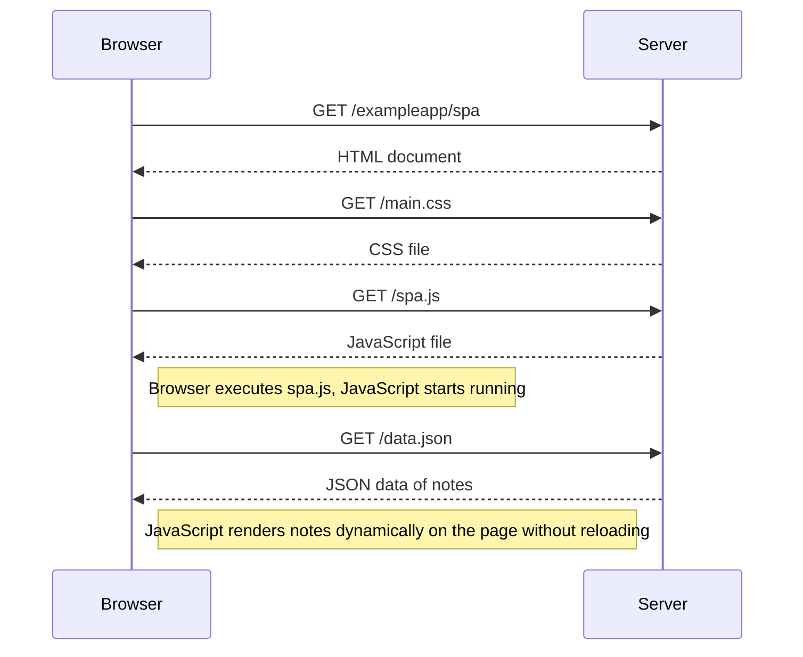

```mermaid
sequenceDiagram
    participant Browser
    participant Server

    Browser->>Server: GET /exampleapp/spa
    Server-->>Browser: HTML document

    Browser->>Server: GET /main.css
    Server-->>Browser: CSS file

    Browser->>Server: GET /spa.js
    Server-->>Browser: JavaScript file

    Note right of Browser: Browser executes spa.js, JavaScript starts running

    Browser->>Server: GET /data.json
    Server-->>Browser: JSON data of notes

    Note right of Browser: JavaScript renders notes dynamically on the page without reloading
```
