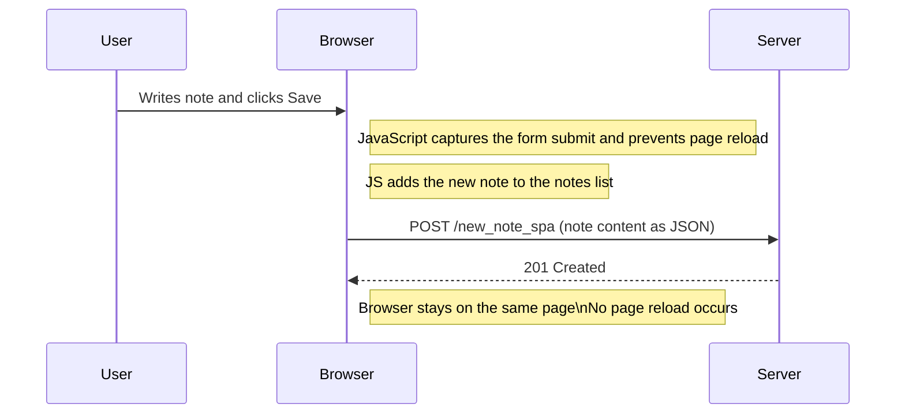

```mermaid
sequenceDiagram
    participant User
    participant Browser
    participant Server

    User->>Browser: Writes note and clicks Save

    Note right of Browser: JavaScript captures the form submit and prevents page reload

    Note right of Browser: JS adds the new note to the notes list

    Browser->>Server: POST /new_note_spa (note content as JSON)

    Server-->>Browser: 201 Created

    Note right of Browser: Browser stays on the same page\nNo page reload occurs
```
